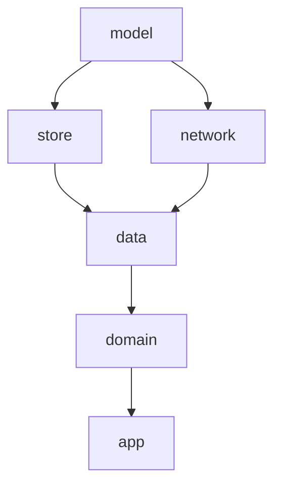

# Overview

The app is divided into 2 types of high-level modules:

- **Runner**: launches the app on respective platforms
- **Common**: holds all the code related to the app features and functionality.

### Runner modules

They are only responsible for launching the app. E.g. for Android, `androidApp` contains `MainActivity` and Application` class.

- `androidApp`
- `desktopApp`
- `iosApp`

## App Architecture and Data Flow

The **common** module uses clean architecture with reactive data flow:

1. **UI → ViewModels**

   - ViewModels manage UI state and interactions.
   - Use cases execute business logic.
   - Data updates via Kotlin Flows.

2. **ViewModels → Domain Layer**

   - Use cases handle core logic.
   - `PollingInteractor`, `ObserveBalanceInteractor`, `ObserveTransactionsInteractor` manage data polling every 10 seconds.

3. **Domain Layer → Data Layer**

   - Repositories manage data operations between network and storage.

4. **Data Storage Strategy**
   - In-memory for quick access.
   - Network fetches fresh data.
   - Store manages persistence.

## Key Features

### Directory Structure

```
common/
├── app/         # Application-level components and utilities
├── data/        # Data layer implementations and repositories
├── domain/      # Domain models, use cases, and business logic
├── models/      # Shared data models and DTOs
├── network/     # Network-related code and API clients
└── store/       # State management and data persistence
```

### Data Flow



### Testing

Unit tests cover the following components:

1. **Domain Layer Tests**

   - Use case implementations
   - Polling interactors
   - Business logic validation

2. **Data Layer Tests**

   - Repository implementations
   - Data mapping and transformations

3. **ViewModel Tests**
   - State management
   - User interaction handling
   - Data flow processing
  
# Demo

https://github.com/user-attachments/assets/cdbd2afd-eb5f-4304-b910-a3481414dea4

